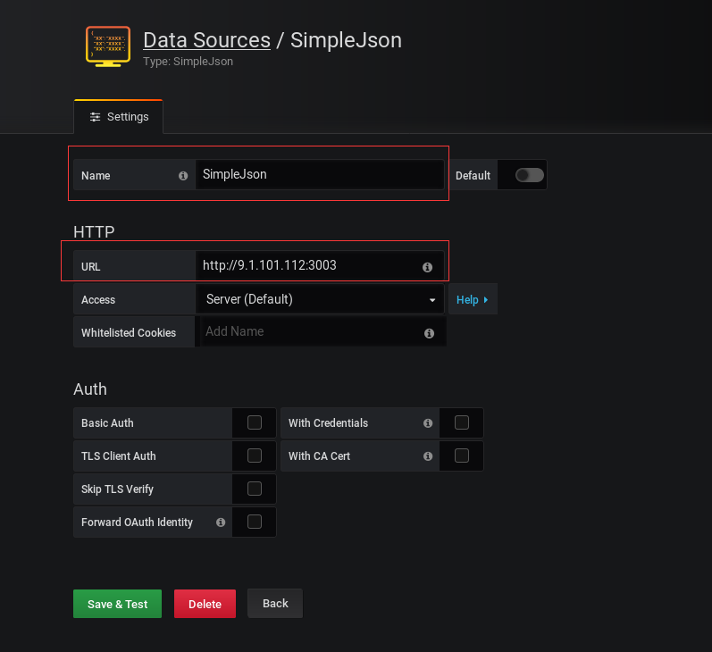
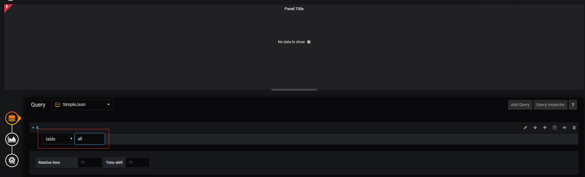

# simple_json_flask_omnibus
> grafana --> simple json databasource plugin --> python3&flask --> netcool omnibus(Sybase Database)

## 参考
* https://grafana.com/grafana/plugins/grafana-simple-json-datasource
* https://github.com/grafana/simple-json-datasource
* https://gist.github.com/linar-jether/95ff412f9d19fdf5e51293eb0c09b850

## 环境及使用
```shell script
cd /opt
git clone https://github.com/sakura1357/simple_json_flask_omnibus.git
cd simple_json_flask_omnibus/
mkdir venv  # 建议使用virtualenv，方便管理依赖
python3 -m venv venv/
source venv/bin/activate
pip3 install -r requirements.txt
```
## 部署
由于需求比较简单，也没有太多的访问压力，所以并没有使用 uwsgi + nginx，而是直接写了脚本 nohup 后台启动。
### 1.后端启动
* 脚本启动:具体参数可查看脚本源代码
```shell script
bash control.sh -u
```
* uwsgi + nginx 教程很多，自行搜索配置一下 
### 2. Grafana data source 配置
使用grafana-simple-json-datasource数据源，URL配置刚才启动的Flask地址。

### 3.panel面板配置
根据代码返回的样例，返回类型要选table，输入合适的查询条件，这里截图报错了是因为没有启动后端服务，问题不大，只是一个说明。


## 实现
需求比较简单，只实现了/query返回table类型的数据。后期如有新需求的话，可能会更新，随缘。